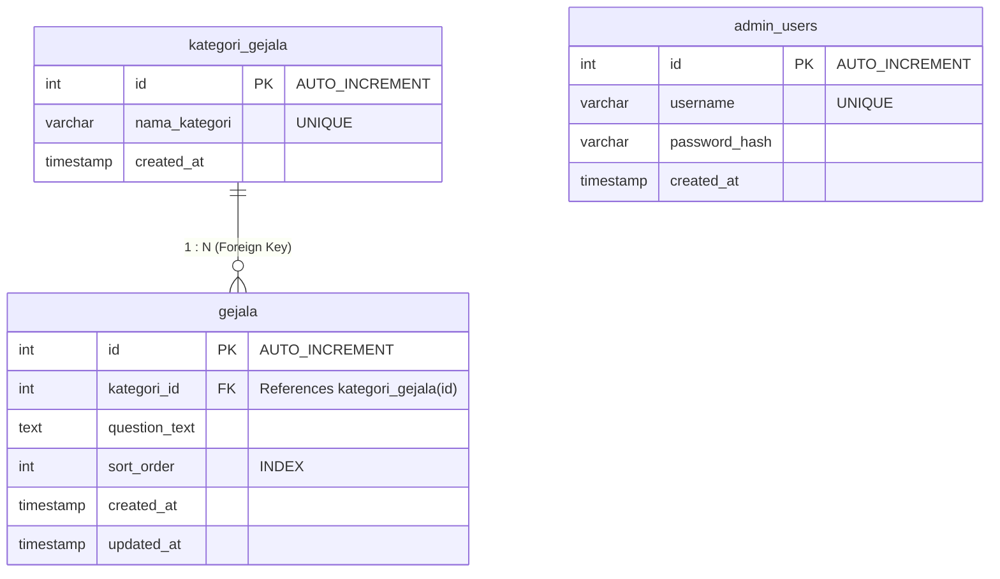

# Dokumentasi Entity-Relationship Diagram (ERD) & Struktur Database

Dokumen ini menjelaskan rancangan **Entity-Relationship Diagram (ERD)** dan struktur tabel basis data terbaru untuk aplikasi **MentalHealth** setelah pemisahan tabel lama (`datasets`) menjadi dua tabel yang terelasi: `kategori_gejala` dan `gejala`.

---

## 1. Entity-Relationship Diagram (ERD)

Berikut adalah hubungan antar entitas dalam database `mentalhealth`:



---

## 2. Struktur Tabel Detil

### Tabel 1: `kategori_gejala`
Tabel ini digunakan untuk menyimpan kategori gejala klinis berdasarkan skala DASS-21 (Depresi, Kecemasan, Stres).

| No | Field | Type | Size | Keterangan |
| :--- | :--- | :--- | :--- | :--- |
| 1 | id | Int | 11 | Identitas kategori gejala (Primary Key) |
| 2 | nama_kategori | Varchar | 50 | Nama kategori gejala (Depresi, Kecemasan, Stres) (Unique) |
| 3 | created_at | Timestamp | - | Waktu pembuatan baris data |

### Tabel 2: `gejala`
Tabel ini menyimpan butir-butir pertanyaan/gejala kuesioner DASS-21 yang terhubung ke kategorinya masing-masing.

| No | Field | Type | Size | Keterangan |
| :--- | :--- | :--- | :--- | :--- |
| 1 | id | Int | 11 | Identitas gejala (Primary Key) |
| 2 | kategori_id | Int | 11 | ID Kategori Gejala (Foreign Key) |
| 3 | question_text | Text | - | Pertanyaan gejala klinis (kuesioner DASS-21) |
| 4 | sort_order | Int | 11 | Nomor urut penampilan pertanyaan |
| 5 | created_at | Timestamp | - | Waktu pembuatan baris data |
| 6 | updated_at | Timestamp | - | Waktu pembaruan baris data terakhir |

> Hubungan antara `kategori_gejala` and `gejala` diatur dengan opsi `ON DELETE CASCADE`. Ketika suatu kategori gejala dihapus, semua data gejala terkait di tabel `gejala` akan ikut terhapus secara otomatis guna menjaga integritas referensial.

### Tabel 3: `admin_users`
Tabel ini menyimpan data akun administrator untuk otentikasi akses panel kontrol admin.

| No | Field | Type | Size | Keterangan |
| :--- | :--- | :--- | :--- | :--- |
| 1 | id | Int | 11 | Identitas admin (Primary Key) |
| 2 | username | Varchar | 64 | Username login admin (Unique) |
| 3 | password_hash | Varchar | 255 | Hash password administrator |
| 4 | created_at | Timestamp | - | Waktu pendaftaran akun admin |

---

## 3. SQL Data Definition Language (DDL)

Berikut adalah perintah SQL DDL lengkap yang digunakan untuk menginisialisasi basis data terbaru:

```sql
-- Pembuatan Database
CREATE DATABASE IF NOT EXISTS `mentalhealth` 
CHARACTER SET utf8mb4 
COLLATE utf8mb4_unicode_ci;

USE `mentalhealth`;

-- 1. Tabel Kategori Gejala
CREATE TABLE IF NOT EXISTS `kategori_gejala` (
    `id` INT AUTO_INCREMENT PRIMARY KEY,
    `nama_kategori` VARCHAR(50) NOT NULL UNIQUE,
    `created_at` TIMESTAMP NOT NULL DEFAULT CURRENT_TIMESTAMP
) ENGINE=InnoDB DEFAULT CHARSET=utf8mb4 COLLATE=utf8mb4_unicode_ci;

-- 2. Tabel Gejala
CREATE TABLE IF NOT EXISTS `gejala` (
    `id` INT AUTO_INCREMENT PRIMARY KEY,
    `kategori_id` INT NOT NULL,
    `question_text` TEXT NOT NULL,
    `sort_order` INT NOT NULL DEFAULT 0,
    `created_at` TIMESTAMP NOT NULL DEFAULT CURRENT_TIMESTAMP,
    `updated_at` TIMESTAMP NOT NULL DEFAULT CURRENT_TIMESTAMP ON UPDATE CURRENT_TIMESTAMP,
    INDEX `idx_sort` (`sort_order`),
    FOREIGN KEY (`kategori_id`) REFERENCES `kategori_gejala`(`id`) ON DELETE CASCADE
) ENGINE=InnoDB DEFAULT CHARSET=utf8mb4 COLLATE=utf8mb4_unicode_ci;

-- 3. Tabel Admin Users
CREATE TABLE IF NOT EXISTS `admin_users` (
    `id` INT AUTO_INCREMENT PRIMARY KEY,
    `username` VARCHAR(64) NOT NULL UNIQUE,
    `password_hash` VARCHAR(255) NOT NULL,
    `created_at` TIMESTAMP NOT NULL DEFAULT CURRENT_TIMESTAMP
) ENGINE=InnoDB DEFAULT CHARSET=utf8mb4 COLLATE=utf8mb4_unicode_ci;
```
